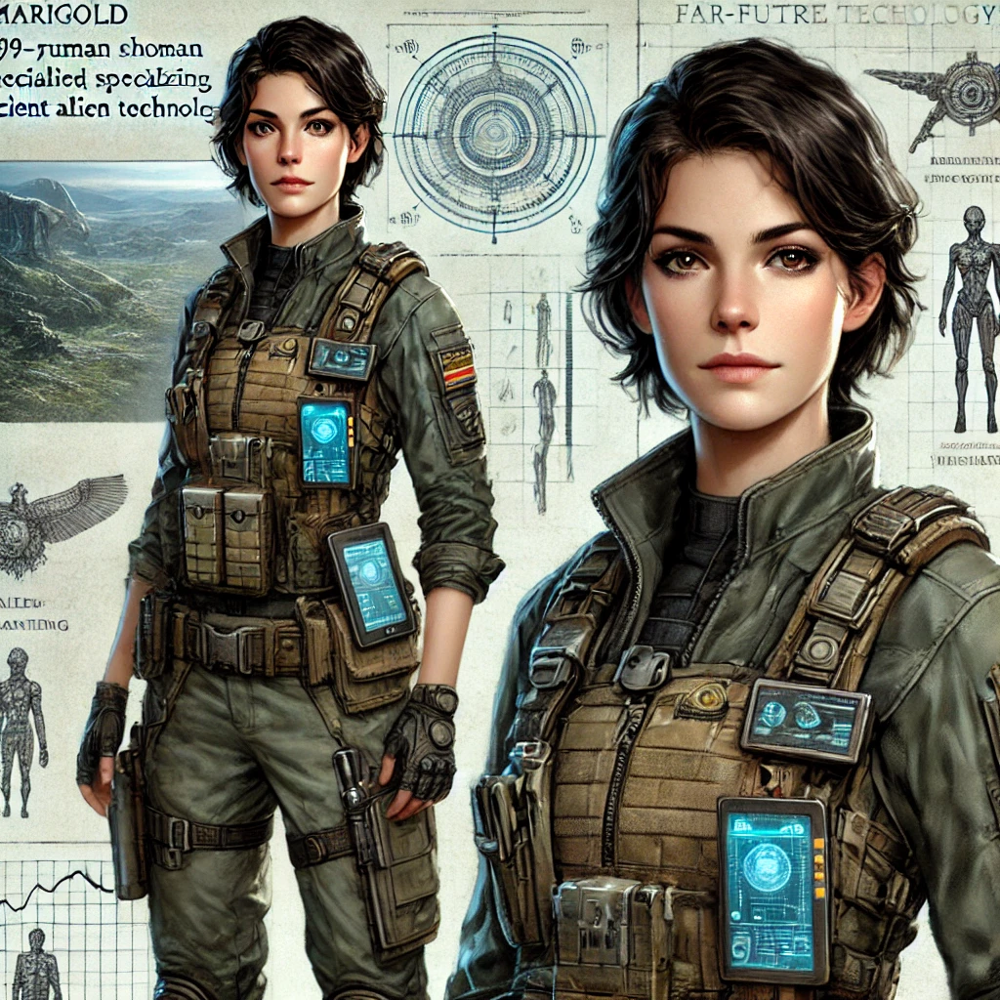
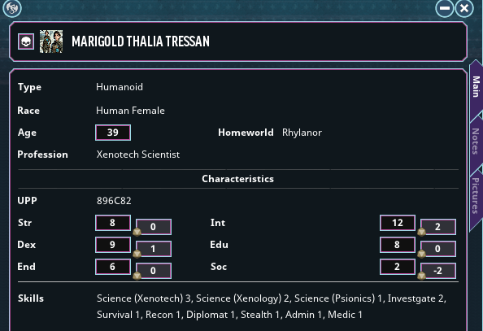

# Marigold Thalia Tressan

Here is an image of Marigold (the scientist that Ceaser and Kaz know). The one that you are lookingfor along with the ship. Her full name is 'Marigold Thalia Tressan'.

\

She's a fit 39 year old scientiest from Rhylanor. She specalizes in 
Xenotechnology, but has other smart. And, that's the only way she 
where her family is if she even has a loner over the last few years. Often 
gig is slightly unusual as she is time to time, if for no other reason 
Kaz. I'm not going to say too much more for now. But, you may learn more in game.

## Marigold's Stats:

